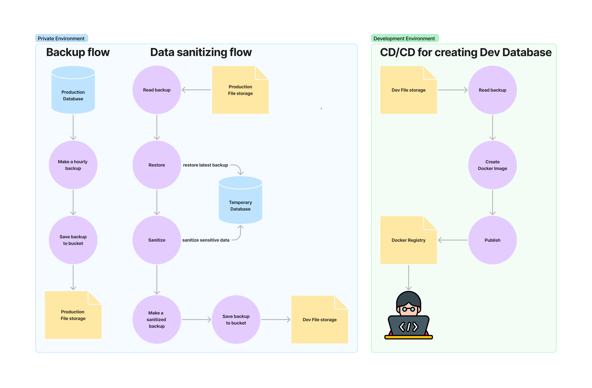

# plyo/postgres

This repo contains 3 docker images and 1 CI/CD workflow:

1. [plyo/postgres:database-*](/database) - PostgreSQL server v13, v14 with 3 pre-configured roles based on official docker postgres image
2. [plyo/postgres:backups-*](/backups) - Rotated backups which can work with several database instances and saving backups into s3 storage
3. [plyo/postgres:sanitizer-*](/sanitizer) - Service for sanitizing data from the backup for preparing development database backup.
4. [CI/CD](/.github/workflows/publish-sanitized-db.yaml) to push sanitized database into docker image

Components schema:

See all available [tags on Docker Hub](https://hub.docker.com/r/plyo/postgres/tags/) 
